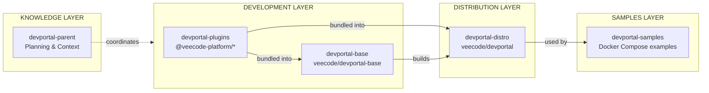

# VeeCode DevPortal — AI Agent Guidelines

This document provides high-level guidance for AI agents working across the VeeCode DevPortal ecosystem. For project-specific details, refer to each repository's own AGENTS.md file.

## Ecosystem Overview

VeeCode DevPortal is a production-ready, open-source Backstage distribution designed for Internal Developer Portal (IDP) solutions. It enables organizations to adopt platform engineering practices without the operational overhead of building and maintaining a custom Backstage deployment.

### Repository Map

| Repository | Purpose | Type |
|------------|---------|------|
| **devportal-parent** | Shared documentation & context | Documentation |
| **devportal-plugins** | Plugin development workspaces | Monorepo (Yarn) |
| **devportal-base** | Minimal runtime foundation | Monorepo (Turbo) |
| **devportal-distro** | Production distribution | Docker build |
| **devportal-samples** | Integration examples | Configuration |

### Architecture Diagram

### Dependency Flow

Changes propagate left-to-right through the architecture:

1. **Plugin change** → Publish to NPM → Base consumes as dependency + Distro bundles → Rebuild images
2. **Base change** → Rebuild base image → Distro rebuilds (uses base image) → Samples may update
3. **Distro change** → Rebuild distro image → Samples may update
4. **Samples change** → Configuration only, no rebuild needed

The **knowledge layer** (devportal-parent) coordinates conventions and documentation across the **development layer** (plugins + base), which feeds into the **distribution layer** (distro), ultimately used by the **samples layer** (DevPortal examples).

## Technology Stack

| Category | Technology |
|----------|------------|
| Runtime | Node.js 20/22 |
| Language | TypeScript |
| Framework | Backstage |
| UI | React |
| Package Manager | Yarn 4 |
| Container Base | Red Hat UBI 10 |

## Projects

### devportal-plugins

The plugin development hub. Contains multiple independent Yarn workspaces, each housing a Backstage plugin. Use this repository when creating new plugins or modifying existing ones. Each workspace can be built, tested, and published independently via Makefile commands. Plugins are published to the `@veecode-platform` NPM namespace in both static and dynamic formats.

→ See [projects/devportal-plugins.md](./projects/devportal-plugins.md) for details

### devportal-base

The minimal runtime foundation. Contains the core Backstage backend and frontend applications, plus essential base plugins. This is a Turbo-powered monorepo that produces the `veecode/devportal-base` Docker image. Use this repository when modifying the core runtime, build system, or adding features that affect all deployments.

→ See [projects/devportal-base.md](./projects/devportal-base.md) for details

### devportal-distro

The production distribution builder. Takes the base image and bundles additional plugins to create the full `veecode/devportal` Docker image. Use this repository when deciding which plugins to include in the standard distribution or when modifying the Docker build process.

→ See [projects/devportal-distro.md](./projects/devportal-distro.md) for details

### devportal-samples

Integration examples and deployment templates. Contains Docker Compose configurations for various authentication providers (GitHub, Azure, LDAP) and integrations (Jenkins, SonarQube, Kubernetes). Use this repository when adding new integration examples or helping users configure specific setups.

→ See [projects/devportal-samples.md](./projects/devportal-samples.md) for details

## Key Concepts

### Dynamic Plugin System

Plugins can be loaded at runtime without rebuilding the application. Configuration is done via `dynamic-plugins.yaml`, which specifies which plugins to enable/disable and their settings. Pre-installed plugins live in the Docker image; external plugins can be downloaded from NPM at startup.

→ See [architecture/dynamic-plugins.md](./architecture/dynamic-plugins.md) for the complete guide

### Profile System

Authentication and catalog providers are configured via profiles, selected by the `VEECODE_PROFILE` environment variable. Available profiles include `github`, `azure`, `ldap`, `keycloak`, and `local` (for development). Each profile bundles the appropriate auth provider and entity discovery configuration.

→ See [architecture/profiles.md](./architecture/profiles.md) for profile details

### Configuration Hierarchy

Backstage configuration merges multiple files in order, with later files overriding earlier ones. Environment variables are interpolated using `${VAR_NAME}` syntax. Understanding this hierarchy is essential for debugging configuration issues.

→ See [architecture/overview.md](./architecture/overview.md) for the full hierarchy

## Cross-Repository Workflow

When making changes that span multiple repositories:

1. **Identify the lowest layer affected** — Start from plugins → base → distro → samples
2. **Make changes bottom-up** — Lower layers must be updated and published before higher layers can consume them
3. **Consider version bumps** — Plugin changes may require version updates in base/distro dependencies
4. **Test at each layer** — Verify changes work before moving to the next layer
5. **Document breaking changes** — If APIs change, note them for upstream consumers

### Common Scenarios

| Task | Repositories Involved |
|------|----------------------|
| New plugin | plugins → distro (if bundling) → samples (if example needed) |
| Core feature | base → distro → samples |
| New integration | samples only (or plugins if new plugin needed) |
| Bug fix in plugin | plugins → distro (rebuild) |
| Backstage upgrade | base → plugins (compatibility) → distro → samples |

## Conventions

All repositories follow shared conventions for consistency:

- **Naming** — Package names, file names, API patterns → [conventions/naming.md](./conventions/naming.md)
- **Versioning** — Semantic versioning, release process → [conventions/versioning.md](./conventions/versioning.md)
- **Code Style** — TypeScript and React patterns → [conventions/code-style.md](./conventions/code-style.md)
- **Commits** — Conventional commits format → [conventions/commits.md](./conventions/commits.md)

## Security Principles

- Never commit secrets to repositories
- Use environment variables for sensitive configuration
- Guest authentication (`local` profile) is for development only
- Container images use Red Hat UBI base for enterprise security
- Document required secrets in deployment examples

## Getting Help

| Topic | Documentation |
|-------|---------------|
| System architecture | [architecture/overview.md](./architecture/overview.md) |
| Dynamic plugins | [architecture/dynamic-plugins.md](./architecture/dynamic-plugins.md) |
| Auth profiles | [architecture/profiles.md](./architecture/profiles.md) |
| Deployment patterns | [architecture/deployment.md](./architecture/deployment.md) |
| Terminology | [glossary.md](./glossary.md) |
| Past decisions | [decisions/](./decisions/) |

For project-specific commands, workflows, and troubleshooting, check the AGENTS.md file in each repository.
