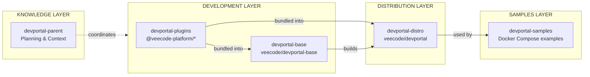

# VeeCode DevPortal — Shared Context Repository

This repository contains shared documentation, context, and planning artifacts for all VeeCode DevPortal projects.

## About VeeCode DevPortal

VeeCode DevPortal is a ready-to-use, open-source Backstage distribution. It enables organizations to adopt platform engineering practices as an Internal Developer Portal (IDP) solution.

Building an internal platform is already a complex task by itself. VeeCode DevPortal is a ready-to-use solution that removes the operational overhead of building and maintaining a Backstage distro.

**Technology Stack:** Node.js, TypeScript, React, Backstage

## Repository Purpose

This repo serves as the central knowledge base for VeeCode DevPortal. It is **not** a code repository, but rather the shared context that AI agents and team members use to maintain consistency across all service repositories.

## Quick Navigation

### For AI Agents

Start here when working on any VeeCode DevPortal project:

- **[AGENTS.md](./AGENTS.md)** — Comprehensive AI agent guidelines
- **[CLAUDE.md](./CLAUDE.md)** — Claude-specific guidance

### Architecture

Understand how the system is designed:

- [Architecture Overview](./architecture/overview.md) — System design and layers
- [Dynamic Plugins](./architecture/dynamic-plugins.md) — Plugin loading system
- [Profiles](./architecture/profiles.md) — Authentication profiles
- [Deployment](./architecture/deployment.md) — Container and Kubernetes patterns

### Conventions

Follow consistent patterns across repositories:

- [Naming Conventions](./conventions/naming.md) — Package, file, and API naming
- [Versioning Strategy](./conventions/versioning.md) — Version numbers and releases
- [Code Style](./conventions/code-style.md) — TypeScript and React patterns
- [Commit Conventions](./conventions/commits.md) — Conventional commits format

### Project References

Learn about each repository in the ecosystem:

- [devportal-base](./projects/devportal-base.md) — Core runtime foundation
- [devportal-distro](./projects/devportal-distro.md) — Production distribution
- [devportal-plugins](./projects/devportal-plugins.md) — Plugin development
- [devportal-samples](./projects/devportal-samples.md) — Integration examples

### Reference

- [Glossary](./glossary.md) — Terms and definitions
- [Decisions (ADRs)](./decisions/README.md) — Architecture Decision Records

## Repository Ecosystem

## Getting Started

### For New Contributors

1. Read the [Architecture Overview](./architecture/overview.md)
2. Review [Naming Conventions](./conventions/naming.md) and [Code Style](./conventions/code-style.md)
3. Check project-specific docs in [projects/](./projects/)

### For AI Agents

1. Read [AGENTS.md](./AGENTS.md) first
2. Check the relevant [project reference](./projects/) for the repository you're working on
3. Follow conventions documented here

### For Deployment

1. Choose an integration from [devportal-samples](./projects/devportal-samples.md)
2. Review [Profiles](./architecture/profiles.md) for authentication setup
3. Follow [Deployment](./architecture/deployment.md) patterns

## Repository Links

| Repository | Description | Links |
|------------|-------------|-------|
| devportal-parent | Shared context (this repo) | [GitHub](https://github.com/veecode-platform/devportal-parent) |
| devportal-plugins | Plugin development | [GitHub](https://github.com/veecode-platform/devportal-plugins) |
| devportal-base | Core runtime | [GitHub](https://github.com/veecode-platform/devportal-base) |
| devportal-distro | Production image | [GitHub](https://github.com/veecode-platform/devportal-distro) |
| devportal-samples | Integration examples | [GitHub](https://github.com/veecode-platform/devportal-samples) |

## Docker Images

| Image | Purpose |
|-------|---------|
| `veecode/devportal-base` | Minimal runtime foundation |
| `veecode/devportal` | Full distribution with plugins |

## License

Apache License 2.0

## Contributing

Contributions are welcome! Please read the [conventions](./conventions/) documentation before submitting changes.
