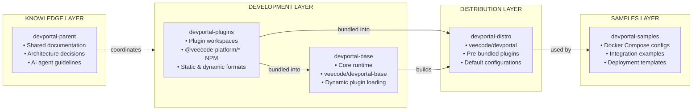

# Architecture Overview

This document describes the high-level architecture of the VeeCode DevPortal ecosystem.

## System Context

VeeCode DevPortal is an Internal Developer Portal (IDP) built on Backstage. It provides a unified interface for developers to discover services, access documentation, manage infrastructure, and execute workflows.

```
┌────────────────────────────────────────────────────────────────────────┐
│                           DEVELOPERS                                   │
└────────────────────────────────┬───────────────────────────────────────┘
                                 │
                                 ▼
┌────────────────────────────────────────────────────────────────────────┐
│                      VeeCode DevPortal                                 │
│  ┌─────────────┐  ┌─────────────┐  ┌─────────────┐  ┌─────────────┐    │
│  │  Catalog    │  │  TechDocs   │  │  Scaffolder │  │  Kubernetes │    │
│  └─────────────┘  └─────────────┘  └─────────────┘  └─────────────┘    │
└────────────────────────────────┬───────────────────────────────────────┘
                                 │
        ┌────────────────────────┼────────────────────────┐
        ▼                        ▼                        ▼
┌───────────────┐      ┌───────────────┐      ┌───────────────┐
│    GitHub     │      │  Kubernetes   │      │   CI/CD       │
│   Azure DevOps│      │   Clusters    │      │  (Jenkins,    │
│   Bitbucket   │      │               │      │   Actions)    │
└───────────────┘      └───────────────┘      └───────────────┘
```

## Layered Architecture

The ecosystem follows a layered architecture where each layer has a specific responsibility:



**Layer Responsibilities:**

- **Knowledge Layer** — Coordinates all repositories through shared documentation, conventions, and architectural decisions
- **Development Layer** — Source code for plugins and core runtime, published to NPM and Docker Hub
- **Distribution Layer** — Production-ready Docker image with pre-bundled plugins
- **Samples Layer** — Ready-to-use deployment examples for various integration scenarios

## Component Architecture

### Backend

The backend is a Node.js application built with the Backstage backend framework:

```pre
┌─────────────────────────────────────────────────────────────────┐
│                      Backend Process                            │
│                                                                 │
│  ┌─────────────┐  ┌─────────────┐  ┌─────────────┐              │
│  │  Catalog    │  │   Auth      │  │  TechDocs   │              │
│  │  Plugin     │  │  Provider   │  │  Plugin     │              │
│  └─────────────┘  └─────────────┘  └─────────────┘              │
│                                                                 │
│  ┌─────────────┐  ┌─────────────┐  ┌─────────────┐              │
│  │ Scaffolder  │  │  Search     │  │  Dynamic    │              │
│  │  Plugin     │  │  Plugin     │  │  Plugins    │              │
│  └─────────────┘  └─────────────┘  └─────────────┘              │
│                                                                 │
│  ┌─────────────────────────────────────────────────┐            │
│  │              Plugin Discovery                   │            │
│  │  (Scans dynamic-plugins-root at startup)        │            │
│  └─────────────────────────────────────────────────┘            │
└─────────────────────────────────────────────────────────────────┘
```

### Frontend

The frontend is a React single-page application:

```
┌─────────────────────────────────────────────────────────────────┐
│                      Frontend App                               │
│                                                                 │
│  ┌─────────────────────────────────────────────────┐           │
│  │              App Shell (Scalprum)                │           │
│  │  • Dynamic module loading                       │           │
│  │  • Route registration                           │           │
│  │  • Theme application                            │           │
│  └─────────────────────────────────────────────────┘           │
│                                                                 │
│  ┌─────────────┐  ┌─────────────┐  ┌─────────────┐             │
│  │  Homepage   │  │   Header    │  │  Catalog    │             │
│  │  Plugin     │  │  Plugin     │  │  UI         │             │
│  └─────────────┘  └─────────────┘  └─────────────┘             │
│                                                                 │
│  ┌─────────────┐  ┌─────────────┐  ┌─────────────┐             │
│  │  TechDocs   │  │ Scaffolder  │  │  Dynamic    │             │
│  │  UI         │  │  UI         │  │  Plugin UI  │             │
│  └─────────────┘  └─────────────┘  └─────────────┘             │
└─────────────────────────────────────────────────────────────────┘
```

## Data Flow

### Configuration Loading

```pre
START
  │
  ▼
┌─────────────────────────────────────┐
│  Load app-config.yaml (base)        │
└──────────────────┬──────────────────┘
                   │
                   ▼
┌─────────────────────────────────────┐
│  Merge app-config.{profile}.yaml    │
│  (based on VEECODE_PROFILE env)     │
└──────────────────┬──────────────────┘
                   │
                   ▼
┌─────────────────────────────────────┐
│  Merge app-config.production.yaml   │
└──────────────────┬──────────────────┘
                   │
                   ▼
┌─────────────────────────────────────┐
│  Apply environment variable         │
│  interpolation (${VAR_NAME})        │
└──────────────────┬──────────────────┘
                   │
                   ▼
┌─────────────────────────────────────┐
│  Final merged configuration         │
└─────────────────────────────────────┘
```

### Plugin Loading

```
Container Start
       │
       ▼
┌──────────────────────────────────────┐
│  install-dynamic-plugins.sh          │
│  • Read dynamic-plugins.yaml         │
│  • Copy pre-installed plugins        │
│  • Download external plugins         │
└──────────────────┬───────────────────┘
                   │
                   ▼
┌──────────────────────────────────────┐
│  Backend Start                       │
│  • Scan dynamic-plugins-root/        │
│  • Load plugin manifests             │
│  • Register plugin routes/APIs       │
└──────────────────┬───────────────────┘
                   │
                   ▼
┌──────────────────────────────────────┐
│  Frontend Start                      │
│  • Scalprum loads plugin modules     │
│  • Register UI components            │
│  • Add navigation items              │
└──────────────────────────────────────┘
```

## Security Architecture

### Authentication Flow

```
User Request
     │
     ▼
┌────────────────┐     ┌────────────────┐
│   Frontend     │────▶│   Backend      │
│   (Browser)    │◀────│   /api/auth    │
└────────────────┘     └───────┬────────┘
                               │
                               ▼
                    ┌────────────────────┐
                    │  Identity Provider │
                    │  (GitHub, Azure,   │
                    │   Keycloak, LDAP)  │
                    └────────────────────┘
```

### Authorization

- **Catalog permissions** — Who can view/edit entities
- **Scaffolder permissions** — Who can run templates
- **RBAC policies** — Defined in `rbac-policy.csv`

## Deployment Architecture

### Docker Compose (Development/Single-Node)

```
┌─────────────────────────────────────────────────────────────────┐
│                      Docker Host                                │
│                                                                 │
│  ┌─────────────────────────────────────────────────────────┐   │
│  │  devportal container                                     │   │
│  │  • Port 7007                                            │   │
│  │  • Environment variables for secrets                    │   │
│  │  • Volume mount for dynamic-plugins.yaml               │   │
│  └─────────────────────────────────────────────────────────┘   │
│                                                                 │
│  ┌─────────────────────────────────────────────────────────┐   │
│  │  PostgreSQL (optional, for production)                  │   │
│  └─────────────────────────────────────────────────────────┘   │
└─────────────────────────────────────────────────────────────────┘
```

### Kubernetes (Production)

```
┌─────────────────────────────────────────────────────────────────┐
│                      Kubernetes Cluster                         │
│                                                                 │
│  ┌─────────────────┐  ┌─────────────────┐                      │
│  │    Ingress      │  │   ConfigMap     │                      │
│  │  (Port 443)     │  │  (app-config,   │                      │
│  │                 │  │   plugins.yaml) │                      │
│  └────────┬────────┘  └────────┬────────┘                      │
│           │                    │                                │
│           ▼                    ▼                                │
│  ┌─────────────────────────────────────────────────────────┐   │
│  │                 DevPortal Deployment                     │   │
│  │  ┌─────────────┐  ┌─────────────┐  ┌─────────────┐      │   │
│  │  │  Pod 1      │  │  Pod 2      │  │  Pod N      │      │   │
│  │  └─────────────┘  └─────────────┘  └─────────────┘      │   │
│  └─────────────────────────────────────────────────────────┘   │
│                          │                                      │
│                          ▼                                      │
│  ┌─────────────────┐  ┌─────────────────┐                      │
│  │   PostgreSQL    │  │   Secrets       │                      │
│  │   (StatefulSet) │  │  (OAuth creds)  │                      │
│  └─────────────────┘  └─────────────────┘                      │
└─────────────────────────────────────────────────────────────────┘
```

## Related Documentation

- [Dynamic Plugins](./dynamic-plugins.md) — Deep dive into the plugin system
- [Profiles](./profiles.md) — Authentication profile system
- [Deployment](./deployment.md) — Container and Kubernetes patterns
